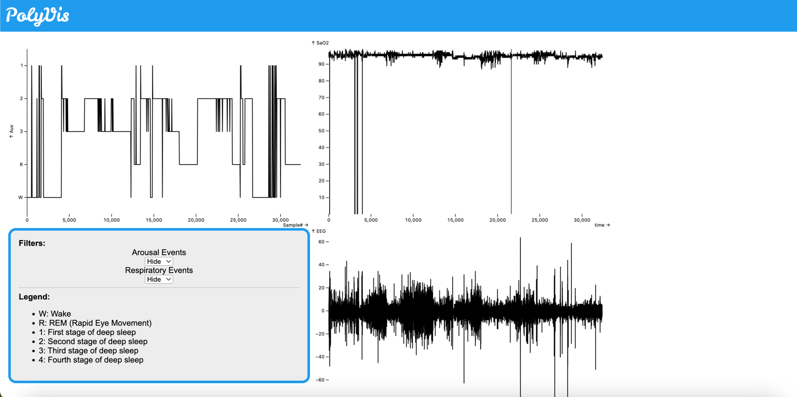

# PolyVis
Repository of PolyVis, a project created as part of my bachelor thesis in Bioinformatics. It aims at visualizing data from Polysomnography and helping to diagnose the different forms of sleep apnea.

## Screenshots

## Installation and Execution
To install, simply run `npm install`.
Then, a development build is available by running `vite` or `npx vite` in the projects root directory.